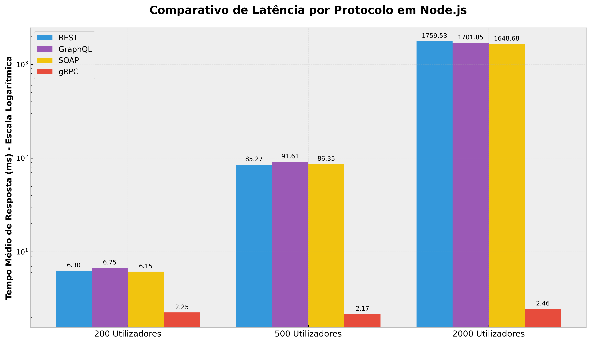
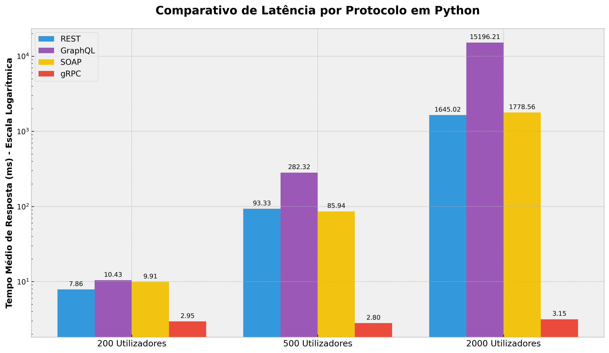
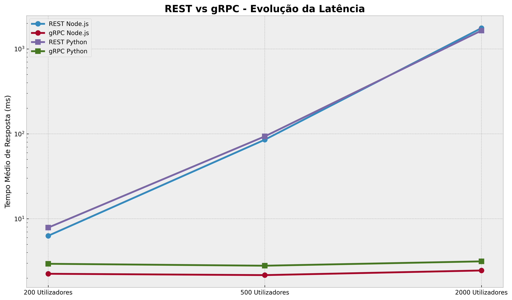
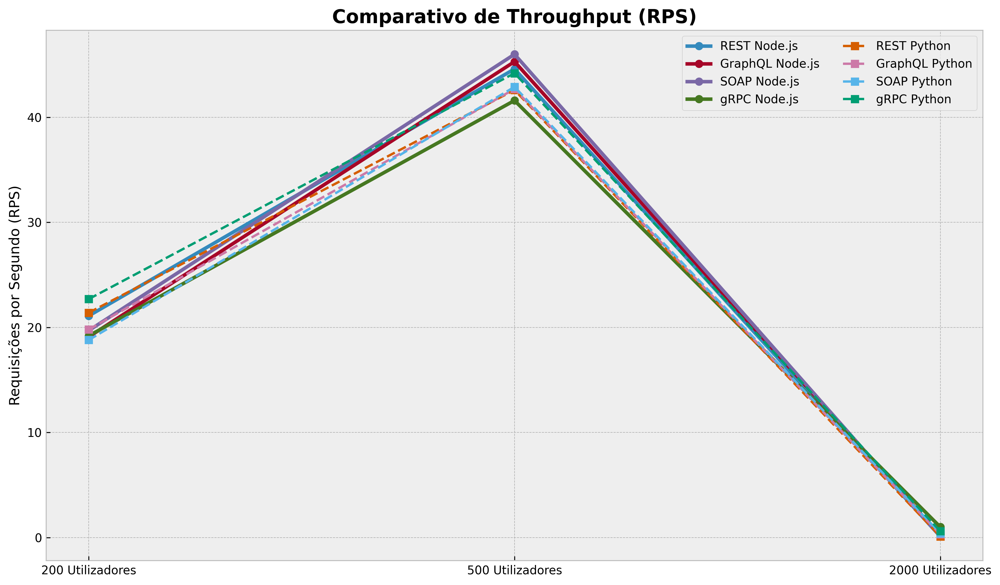

# Comparativo de Desempenho e Escalabilidade de Protocolos em Microsserviços

**Autores:** Caio Victor Ferreira da Silva (2010224) / Brenno Damiany Castro Vidal (2315088) / Diego Henrique Santos Queiroz (2315108)

---

# 1. Introdução e Objetivos

Este documento apresenta uma análise experimental e comparativa do desempenho de quatro das principais tecnologias de comunicação utilizadas na engenharia de software moderna: **REST (Representational State Transfer)**, **GraphQL**, **SOAP (Simple Object Access Protocol)** e **gRPC (Google Remote Procedure Call)**.

O estudo foi conduzido simulando dois ecossistemas tecnológicos amplamente adotados no mercado: **Node.js (TypeScript)** e **Python**. O objetivo principal consiste em avaliar a capacidade de resposta, a estabilidade operacional e a escalabilidade de cada tecnologia sob diferentes níveis de concorrência, identificando gargalos de desempenho (*bottlenecks*) e características arquiteturais que impactam diretamente a eficiência dos microsserviços.

---

# 2. Fundamentação Teórica e Exemplos de Implementação (Python)

Nesta seção, são descritas as origens, características principais, vantagens e desvantagens dos quatro protocolos avaliados. Para ilustrar a implementação prática, são apresentados trechos de código em **Python** demonstrando a criação de um *endpoint* simples de leitura para a entidade "Música" do serviço de streaming.

## 2.1. REST (Representational State Transfer)
**Origem:** Criado por Roy Fielding no ano 2000 em sua tese de doutorado. 
**Características:** É um estilo arquitetural que utiliza os métodos padrão do protocolo HTTP (GET, POST, PUT, DELETE) para manipular recursos. A comunicação é *stateless* (sem estado) e os dados trafegam predominantemente no formato JSON.

* **Vantagens:** Altamente escalável, excelente suporte nativo a cache HTTP, curva de aprendizado baixa e integração universal com qualquer cliente web.
* **Desvantagens:** Problemas de *over-fetching* (receber mais dados do que o necessário) e *under-fetching* (precisar fazer múltiplas requisições para montar uma tela complexa).

**Exemplo de Código (Framework FastAPI):**
```python
from fastapi import FastAPI

app = FastAPI()

@app.get("/musicas/{musica_id}")
def get_musica(musica_id: int):
    # Simulação de busca no banco de dados
    return {
        "id": musica_id, 
        "nome": "Bohemian Rhapsody", 
        "artista": "Queen"
    }
```

## 2.2. GraphQL
**Origem:** Desenvolvido internamente pelo Facebook em 2012 e lançado como código aberto em 2015.
**Características:** É uma linguagem de consulta de dados para APIs. Em vez de múltiplos *endpoints*, expõe uma única rota HTTP (geralmente via POST). O cliente tem o poder de especificar exatamente quais campos deseja receber como resposta.

* **Vantagens:** Resolve o *over-fetching* e *under-fetching*, possui tipagem forte via *Schema* e permite a evolução da API sem a necessidade de versionamento (v1, v2).
* **Desvantagens:** Dificuldade para implementar cache nativo no nível do HTTP, risco de consultas maliciosas ou excessivamente complexas derrubarem o servidor (*N+1 query problem*), e consumo elevado de CPU para o *parsing* das consultas.

**Exemplo de Código (Framework Strawberry):**
```python
import strawberry

@strawberry.type
class Musica:
    id: int
    nome: str
    artista: str

@strawberry.type
class Query:
    @strawberry.field
    def musica(self, id: int) -> Musica:
        return Musica(id=id, nome="Bohemian Rhapsody", artista="Queen")

schema = strawberry.Schema(query=Query)
```

## 2.3. SOAP (Simple Object Access Protocol)
**Origem:** Desenvolvido pela Microsoft em 1998 e posteriormente padronizado pelo W3C.
**Características:** É um protocolo rigoroso de troca de mensagens. Utiliza estritamente o formato XML estruturado por um "Envelope" e define seus contratos públicos de forma explícita através de arquivos WSDL (*Web Services Description Language*).

* **Vantagens:** Suporte nativo a transações complexas (ACID), alta segurança inerente (WS-Security) e garantias de entrega de mensagens em integrações de sistemas corporativos legados ou bancários.
* **Desvantagens:** Extremamente verboso (arquivos pesados), parsing de XML custoso para a CPU e dependência de ferramentas específicas para testes e consumo.

**Exemplo de Código (Biblioteca Spyne):**
```python
from spyne import Application, rpc, ServiceBase, Integer, Unicode, ComplexModel

class MusicaModel(ComplexModel):
    id = Integer
    nome = Unicode
    artista = Unicode

class StreamingService(ServiceBase):
    @rpc(Integer, _returns=MusicaModel)
    def listar_musica(ctx, musica_id):
        return MusicaModel(id=musica_id, nome="Bohemian Rhapsody", artista="Queen")
```

## 2.4. gRPC (Google Remote Procedure Call)
**Origem:** Criado pelo Google em 2015 como uma evolução do seu sistema RPC interno (Stubby).
**Características:** Framework de chamadas de procedimento remoto (RPC) de alto desempenho. Utiliza o **HTTP/2** como transporte e **Protocol Buffers** (Protobuf) como linguagem de descrição de interface e formato de serialização binária.

* **Vantagens:** Altíssimo desempenho, baixa latência (payloads binários compactados), suporte a *streaming* bidirecional em tempo real e geração automática de código cliente/servidor para múltiplas linguagens.
* **Desvantagens:** Não é legível por humanos (dificulta a depuração manual), não possui suporte nativo direto nos navegadores web sem o uso de proxies (gRPC-Web) e exige o pré-compartilhamento do arquivo `.proto`.

**Exemplo de Código (grpcio e Protobuf):**
*Arquivo de Contrato (streaming.proto):*
```protobuf
syntax = "proto3";

message MusicaRequest { int32 id = 1; }
message MusicaResponse { int32 id = 1; string nome = 2; string artista = 3; }

service MusicaService {
    rpc GetMusica(MusicaRequest) returns (MusicaResponse);
}
```
*Implementação do Servidor (Python):*
```python
import streaming_pb2
import streaming_pb2_grpc

class MusicaService(streaming_pb2_grpc.MusicaServiceServicer):
    def GetMusica(self, request, context):
        return streaming_pb2.MusicaResponse(
            id=request.id, 
            nome="Bohemian Rhapsody", 
            artista="Queen"
        )
```

---

# 3. Análise Crítica: A Experiência da Equipe na Implementação

Além dos resultados quantitativos de latência e concorrência, a equipe avaliou qualitativamente a experiência de desenvolvimento (Developer Experience - DX) exigida por cada tecnologia durante a construção do serviço de streaming em Python e Node.js.

1. **REST:** Foi a arquitetura que apresentou a curva de implementação mais ágil. No ecossistema Python (FastAPI), a validação de dados via Pydantic e a geração automática do Swagger tornaram o processo produtivo, intuitivo e com baixo atrito para a equipe.
2. **GraphQL:** A equipe notou uma mudança paradigmática forte. A codificação inicial é mais trabalhosa, exigindo a declaração minuciosa dos Tipos (*Schemas*) e a elaboração lógica dos *Resolvers*. Contudo, a flexibilidade perceptível na construção do lado do cliente (poder pedir apenas o que precisa da entidade Músicas ou Usuários) evidenciou por que é tão atrativo para aplicações *Front-end* complexas.
3. **SOAP:** Proporcionou a experiência de desenvolvimento mais engessada e burocrática. A construção em Python via Spyne revelou um ecossistema rigoroso, onde o menor desvio entre o *namespace* declarado e o cabeçalho da requisição `SOAPAction` resultava em falhas críticas de validação de *schema* (ex: `SchemaValidationError`), exigindo grande esforço de depuração apenas para estabelecer a comunicação básica.
4. **gRPC:** Exigiu uma mudança no fluxo de trabalho tradicional da equipe. A necessidade de escrever primeiramente o contrato `.proto` e rodar ferramentas de compilação (*grpc_tools.protoc*) adicionou passos extras ao *build*. No entanto, após esse *setup* inicial, a invocação de métodos como se fossem funções locais simplificou o código. A impossibilidade de testar a API facilmente pelo navegador exigiu o uso de clientes específicos, mas o benefício em performance obtido compensou o rigor da implementação.

---

# 4. Metodologia dos Testes de Carga

Os testes de carga foram executados de forma isolada e controlada em um ambiente conteinerizado utilizando **Docker Compose**, tendo como ferramenta de geração de carga o **Locust**, amplamente utilizado para avaliação de desempenho de aplicações distribuídas.

Todos os testes foram realizados utilizando a mesma infraestrutura computacional e sob condições controladas, garantindo que as diferenças observadas fossem atribuídas predominantemente às características dos protocolos analisados e não a variações do ambiente de execução.

Para avaliar o comportamento dos serviços em diferentes regimes de utilização, foram definidos três cenários de carga com duração estável de **2 minutos** cada:

1. **Cenário Leve (Carga de Base):** 200 usuários simultâneos (*spawn rate*: 20/s).
2. **Cenário Médio (Carga Realista):** 500 usuários simultâneos (*spawn rate*: 50/s).
3. **Cenário Pesado (Teste de Estresse Extremo):** 2000 usuários simultâneos (*spawn rate*: 100/s).

As métricas monitorizadas durante os experimentos foram:

* **Tempo Médio de Resposta (Latência em milissegundos)**
* **Vazão (Throughput em Requisições por Segundo – RPS)**
* **Quantidade de Falhas**
* **Tempo Máximo e Mínimo de Resposta**

---

# 5. Resultados Consolidados

Os resultados apresentados a seguir consolidam os tempos médios de resposta obtidos para cada protocolo nos três cenários de carga avaliados. A latência foi utilizada como principal métrica de comparação por representar diretamente a experiência percebida pelos consumidores dos serviços.

## 5.1 Resultados em Node.js

| Protocolo | 200 Usuários (ms) | 500 Usuários (ms) | 2000 Usuários (ms) |
| :--- | :---: | :---: | :---: |
| REST | 6.30 | 85.27 | 1759.53 |
| GraphQL | 6.75 | 91.61 | 1701.85 |
| SOAP | 6.15 | 86.35 | 1648.68 |
| gRPC | **2.25** | **2.17** | **2.46** |

**Tabela 1.** Evolução da latência média dos protocolos implementados em Node.js.

Observa-se que REST, GraphQL e SOAP apresentaram crescimento significativo da latência conforme a concorrência aumentou. Em contraste, o gRPC manteve desempenho praticamente constante, demonstrando elevada capacidade de escalabilidade.

---

## 5.2 Resultados em Python

| Protocolo | 200 Usuários (ms) | 500 Usuários (ms) | 2000 Usuários (ms) |
| :--- | :---: | :---: | :---: |
| REST | 7.86 | 93.33 | 1645.02 |
| GraphQL | 10.43 | 282.32 | **15196.21** |
| SOAP | 9.91 | 85.94 | 1778.56 |
| gRPC | **2.95** | **2.80** | **3.15** |

**Tabela 2.** Evolução da latência média dos protocolos implementados em Python.

Os resultados demonstram comportamento semelhante ao observado em Node.js para REST e SOAP. Entretanto, o GraphQL apresentou degradação significativamente superior sob carga extrema, atingindo latências superiores a 15 segundos. O gRPC novamente manteve estabilidade praticamente linear.

Os resultados apresentados nas Tabelas 1 e 2 evidenciam uma diferença significativa de comportamento entre os protocolos analisados. Enquanto REST, SOAP e GraphQL apresentaram degradação progressiva da latência à medida que a carga aumentava, o gRPC manteve desempenho praticamente constante em ambos os ambientes de execução.

---

## Figura 1 – Gráfico Comparativo em Node.js



**Figura 1.** Comparação da evolução da latência média dos protocolos implementados em Node.js. Observa-se um crescimento acentuado da latência para REST, SOAP e GraphQL conforme a carga aumenta, enquanto o gRPC mantém desempenho estável.

---

## Figura 2 – Gráfico Comparativo em Python



**Figura 2.** Comparação da evolução da latência média dos protocolos implementados em Python. O destaque fica para a degradação significativa do GraphQL sob carga extrema e para a estabilidade apresentada pelo gRPC.

---

## Figura 3 – Comparação Direta entre REST e gRPC



**Figura 3.** Comparação direta da evolução da latência média entre REST e gRPC nos ambientes Node.js e Python. Enquanto o REST apresenta crescimento exponencial da latência à medida que a concorrência aumenta, o gRPC mantém comportamento praticamente constante, evidenciando sua superior capacidade de escalabilidade.

---

# 6. Análise Técnica e Discussão

## 6.1. Desempenho e Escalabilidade do gRPC

O resultado mais expressivo do estudo foi a estabilidade apresentada pelo gRPC, observada tanto nas Tabelas 1 e 2 quanto nas Figuras 1, 2 e 3.

Enquanto o REST em Node.js passou de **6,30 ms** para **1759,53 ms**, representando um aumento superior a **27.800%**, o gRPC variou apenas de **2,25 ms** para **2,46 ms**, mantendo desempenho praticamente linear.

Essa eficiência pode ser atribuída a três fatores principais:

### HTTP/2 e Multiplexação
Diferentemente do HTTP/1.1, utilizado por REST, SOAP e GraphQL, o HTTP/2 permite múltiplas requisições simultâneas sobre a mesma conexão TCP, reduzindo significativamente problemas de bloqueio e espera.

### Serialização Binária com Protocol Buffers
Enquanto JSON e XML exigem conversões textuais e operações adicionais de parsing, o Protocol Buffers utiliza um formato binário compacto e altamente eficiente.

### Geração Automática de Código
A utilização de contratos fortemente tipados e geração automática de stubs reduz a sobrecarga de processamento e simplifica a comunicação entre serviços.

---

## 6.2. O Colapso do GraphQL em Python

O GraphQL implementado em Python apresentou o pior resultado do estudo sob carga extrema, atingindo uma latência média de **15.196 ms** e um pico superior a **92 segundos**.

Esse comportamento sugere a existência de gargalos associados ao processamento síncrono do mecanismo de resolução de consultas GraphQL. À medida que o número de requisições aumenta, ocorre um crescimento significativo das filas internas de processamento, causando degradação exponencial do tempo de resposta.

Embora o GraphQL ofereça elevada flexibilidade para consultas complexas, seu desempenho pode ser severamente impactado quando utilizado sem estratégias adequadas de cache, paralelização e otimização dos resolvers.

---

## 6.3. Compreendendo a Queda de Throughput (RPS)


Um comportamento aparentemente contraditório observado durante os testes foi a redução da vazão (RPS) à medida que o número de usuários aumentava.

No cenário de 200 usuários, os tempos de resposta eram reduzidos, permitindo que cada usuário virtual concluísse rapidamente seu ciclo de requisição e enviasse novos pedidos.

Entretanto, quando os tempos de resposta passaram para valores superiores a 1 segundo, os usuários virtuais permaneceram bloqueados aguardando respostas do servidor, reduzindo drasticamente a frequência de envio de novas requisições.

Esse comportamento demonstra claramente o fenômeno de saturação da infraestrutura, evidenciando que o limite de capacidade foi alcançado para os protocolos tradicionais muito antes do patamar de 2000 usuários simultâneos.

---

# 7. Conclusão

Os resultados obtidos demonstram diferenças significativas entre as tecnologias analisadas quando submetidas a cenários de alta concorrência.

Enquanto REST, SOAP e GraphQL apresentaram degradação progressiva de desempenho à medida que a carga aumentava, o gRPC manteve níveis de latência praticamente constantes e ausência de falhas relevantes durante todo o experimento.

Os testes evidenciam que a combinação entre HTTP/2, multiplexação de conexões e serialização binária torna o gRPC especialmente adequado para comunicação interna entre microsserviços, onde baixa latência e elevada escalabilidade são requisitos fundamentais.

Por outro lado, REST e GraphQL continuam sendo excelentes alternativas para APIs públicas e integrações externas, oferecendo maior flexibilidade e facilidade de adoção. Contudo, em cenários de alta concorrência, essas tecnologias exigem mecanismos adicionais de escalabilidade, balanceamento de carga, cache e otimização de recursos para manter níveis adequados de desempenho.

Dessa forma, os experimentos reforçam a importância da escolha adequada do protocolo de comunicação conforme o contexto arquitetural da aplicação, demonstrando que não existe uma solução universal, mas sim tecnologias mais apropriadas para necessidades específicas.

Além disso, os gráficos apresentados reforçam visualmente os resultados observados nas tabelas, evidenciando que o aumento da concorrência afeta severamente os protocolos tradicionais baseados em HTTP/1.1, enquanto o gRPC mantém comportamento praticamente linear mesmo sob condições extremas de carga.
