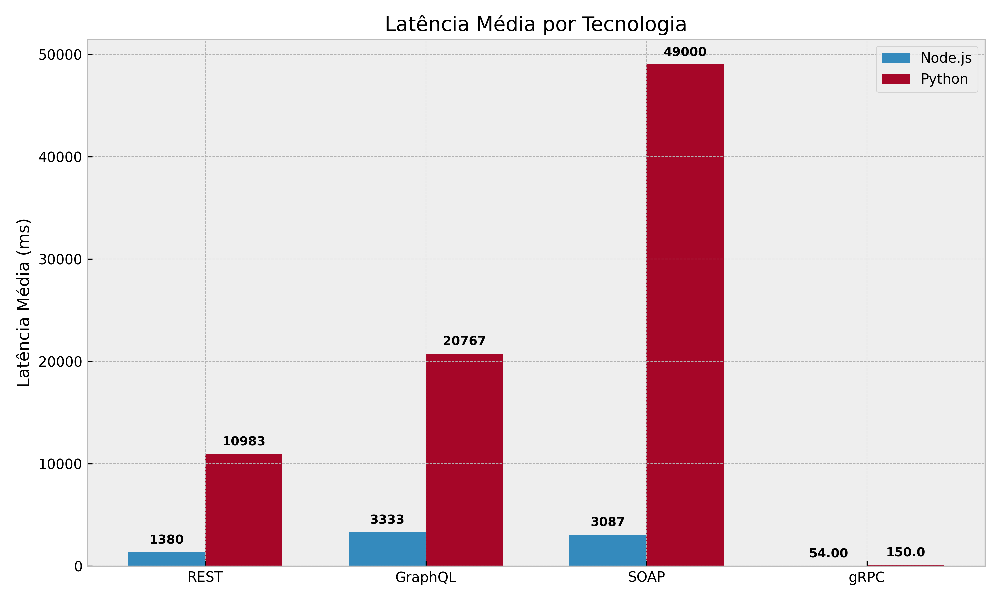
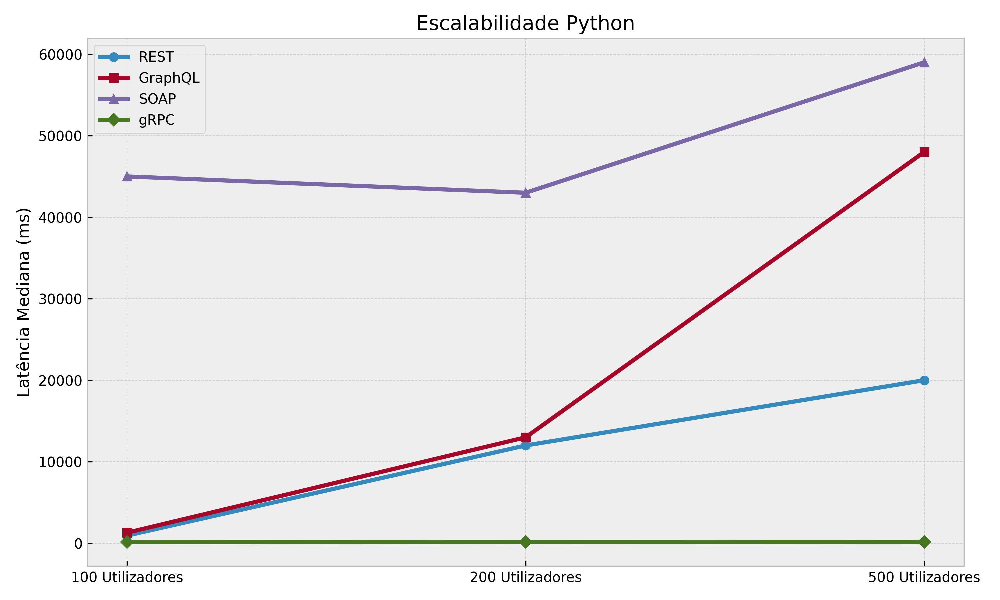
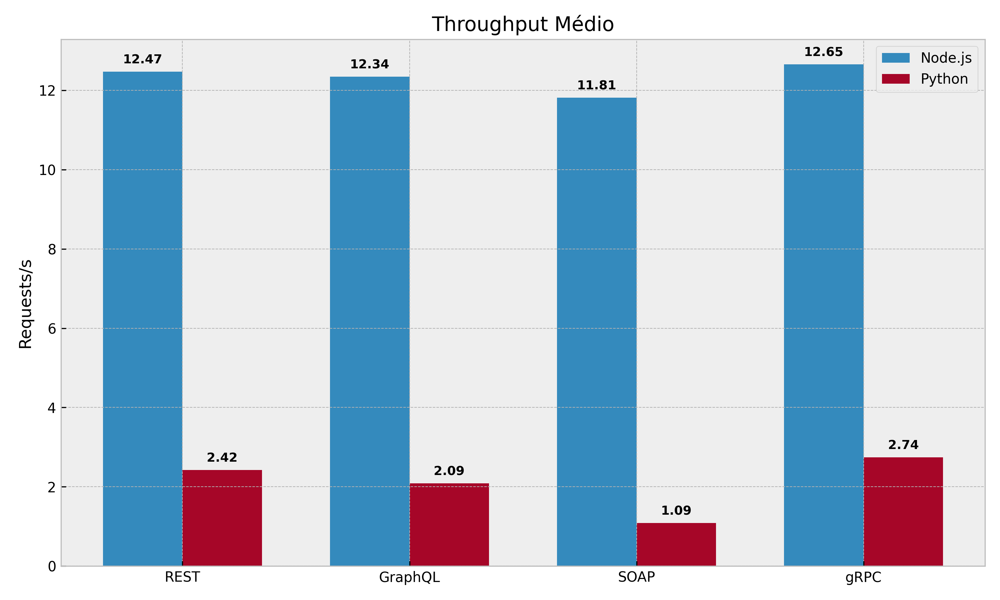

# Comparativo de Desempenho e Escalabilidade de Protocolos em Microsserviços

**Autores:** Caio Victor Ferreira da Silva (2010224) / Brenno Damiany Castro Vidal (2315088) / Diego Henrique Santos Queiroz (2315108)

---

# 1. Introdução e Objetivos

Este documento apresenta uma análise experimental e comparativa do desempenho de quatro das principais tecnologias de comunicação utilizadas na engenharia de software moderna:

* **REST (Representational State Transfer)**
* **GraphQL**
* **SOAP (Simple Object Access Protocol)**
* **gRPC (Google Remote Procedure Call)**

O estudo foi conduzido simulando dois ecossistemas tecnológicos amplamente adotados no mercado: **Node.js (JavaScript)** e **Python**.

O objetivo principal consiste em avaliar a capacidade de resposta, a estabilidade operacional e a escalabilidade de cada tecnologia sob diferentes níveis de concorrência, identificando gargalos de desempenho (*bottlenecks*) e características arquiteturais que impactam diretamente a eficiência dos microsserviços.

---

# 2. Como Executar o Projeto (Guia de Uso)

Para reproduzir os testes e visualizar as APIs em funcionamento localmente, siga os passos abaixo.

## 2.1 Pré-requisitos

* Docker instalado
* Docker Compose instalado
* Portas disponíveis:

  * 5432 (PostgreSQL)
  * 8000 a 8002 (APIs Python)
  * 9000 a 9002 (APIs Node.js)
  * 8089 (Locust)

## 2.2 Clonar o Repositório

```bash
git clone <URL_DO_REPOSITORIO>
cd <NOME_DO_PROJETO>
```

## 2.3 Subir os Serviços

Na raiz do projeto execute:

```bash
docker-compose up -d --build
```

O comando irá construir as imagens Docker e iniciar:

* Banco PostgreSQL
* APIs REST, GraphQL, SOAP e gRPC em Python
* APIs REST, GraphQL, SOAP e gRPC em Node.js
* Ferramenta de testes Locust

## 2.4 Popular o Banco de Dados

Após a inicialização, execute o script de carga inicial:

```bash
docker-compose exec rest_py python seed.py
```

## 2.5 Executar os Testes

Abra o navegador e acesse:

```text
http://localhost:8089
```

Na interface do Locust:

### Number of Users

Escolha um dos cenários:

* 100 usuários
* 200 usuários
* 400 usuários

### Spawn Rate

Sugestão:

```text
20
```

### Host

Exemplos:

REST Node.js:

```text
http://rest_ts:9000
```

REST Python:

```text
http://rest_py:8000
```

GraphQL Node.js:

```text
http://graphql_ts:9001
```

GraphQL Python:

```text
http://graphql_py:8001
```

Clique em **Start Swarming** para iniciar os testes.

## 2.6 Encerrar o Ambiente

```bash
docker-compose down
```

---

# 3. Fundamentação Teórica e Exemplos de Implementação

## 3.1 REST (Representational State Transfer)

### Origem

Criado por Roy Fielding em 2000 durante sua tese de doutorado.

### Características

REST é um estilo arquitetural baseado em recursos que utiliza os métodos do protocolo HTTP:

* GET
* POST
* PUT
* DELETE

A comunicação é *stateless* e normalmente utiliza JSON para troca de dados.

### Vantagens

* Simplicidade de implementação
* Grande compatibilidade com navegadores
* Fácil manutenção
* Curva de aprendizagem reduzida

### Desvantagens

* Over-fetching
* Under-fetching
* Necessidade de múltiplas requisições em cenários complexos

### Exemplo (FastAPI)

```python
from fastapi import FastAPI

app = FastAPI()

@app.get("/musicas/{musica_id}")
def get_musica(musica_id: int):
    return {
        "id": musica_id,
        "nome": "Bohemian Rhapsody",
        "artista": "Queen"
    }
```

---

## 3.2 GraphQL

### Origem

Desenvolvido pelo Facebook em 2012 e disponibilizado como código aberto em 2015.

### Características

GraphQL é uma linguagem de consulta para APIs onde o cliente define exatamente quais dados deseja receber.

### Vantagens

* Elimina over-fetching
* Elimina under-fetching
* Forte sistema de tipagem
* Evolução sem versionamento

### Desvantagens

* Consultas complexas podem degradar desempenho
* Cache HTTP menos eficiente
* Maior consumo de CPU

### Exemplo (Strawberry)

```python
import strawberry

@strawberry.type
class Musica:
    id: int
    nome: str
    artista: str

@strawberry.type
class Query:
    @strawberry.field
    def musica(self, id: int) -> Musica:
        return Musica(
            id=id,
            nome="Bohemian Rhapsody",
            artista="Queen"
        )

schema = strawberry.Schema(query=Query)
```

---

## 3.3 SOAP (Simple Object Access Protocol)

### Origem

Desenvolvido pela Microsoft em 1998 e posteriormente padronizado pelo W3C.

### Características

SOAP é um protocolo baseado em XML que utiliza contratos formais definidos em arquivos WSDL.

### Vantagens

* Segurança avançada
* Garantia de entrega
* Suporte a transações complexas
* Amplamente utilizado em sistemas corporativos

### Desvantagens

* XML extremamente verboso
* Alto custo de processamento
* Maior complexidade de implementação

### Exemplo (Spyne)

```python
from spyne import (
    rpc,
    ServiceBase,
    Integer,
    Unicode,
    ComplexModel
)

class MusicaModel(ComplexModel):
    id = Integer
    nome = Unicode
    artista = Unicode

class StreamingService(ServiceBase):

    @rpc(Integer, _returns=MusicaModel)
    def listar_musica(ctx, musica_id):
        return MusicaModel(
            id=musica_id,
            nome="Bohemian Rhapsody",
            artista="Queen"
        )
```

---

## 3.4 gRPC (Google Remote Procedure Call)

### Origem

Desenvolvido pelo Google em 2015.

### Características

Framework RPC baseado em:

* HTTP/2
* Protocol Buffers (Protobuf)

Os dados são serializados em formato binário.

### Vantagens

* Baixa latência
* Alto desempenho
* Streaming bidirecional
* Menor consumo de banda

### Desvantagens

* Menor legibilidade humana
* Dependência de arquivos `.proto`
* Necessidade de ferramentas específicas

### Exemplo de Contrato

```proto
syntax = "proto3";

message MusicaRequest {
  int32 id = 1;
}

message MusicaResponse {
  int32 id = 1;
  string nome = 2;
  string artista = 3;
}

service MusicaService {
  rpc GetMusica(MusicaRequest)
      returns (MusicaResponse);
}
```

### Exemplo do Servidor

```python
import streaming_pb2
import streaming_pb2_grpc

class MusicaService(
    streaming_pb2_grpc.MusicaServiceServicer
):

    def GetMusica(self, request, context):
        return streaming_pb2.MusicaResponse(
            id=request.id,
            nome="Bohemian Rhapsody",
            artista="Queen"
        )
```

---

# 4. Análise Crítica da Implementação e Developer Experience (DX)

A experiência prática de codificação nas linguagens Python e TypeScript (Node.js) revelou contrastes profundos nos paradigmas arquiteturais avaliados. A escolha do protocolo de comunicação dita não apenas a performance da rede, mas impacta diretamente a curva de aprendizado da equipe, a velocidade de desenvolvimento e a facilidade de manutenção e depuração do código.

### 4.1. REST (Representational State Transfer)
O REST consolidou-se como a arquitetura de adoção mais fluida, intuitiva e de menor atrito para a equipe. O mapeamento direto de ações de CRUD para verbos HTTP (GET, POST, PUT, DELETE) torna a lógica de negócio altamente previsível.
* **No Ecossistema Python:** A utilização do framework FastAPI elevou a produtividade de forma ímpar. A integração nativa com o Pydantic para validação de dados e a geração automática da documentação interativa (Swagger/OpenAPI) baseada em tipagem estática eliminaram horas de trabalho manual.
* **No Ecossistema Node.js:** O uso do Express.js demonstrou a flexibilidade de um framework minimalista e não-opinativo, permitindo subir *endpoints* em poucos minutos. No entanto, por não possuir validação nativa e estruturação rígida como o FastAPI, exigiu maior disciplina da equipe para manter a padronização das rotas e validação de *payloads*.

### 4.2. GraphQL
A implementação do GraphQL exigiu uma forte mudança de paradigma estrutural. Diferente do REST, onde a preocupação central é o roteamento (*endpoints*), o GraphQL transfere a complexidade para a modelagem do domínio e a resolução de grafos.
* **Desafios de Implementação:** A configuração inicial provou-se densa. A equipe precisou declarar rigorosamente os *Schemas* (tipos, *Queries* e *Mutations*) e construir os *Resolvers* individuais para buscar cada campo no banco de dados, utilizando Strawberry no Python e Apollo Server no Node.js.
* **O Retorno sobre o Investimento:** Toda a complexidade adicionada ao backend (servidor) é compensada pela extrema flexibilidade entregue ao cliente (Front-end). A capacidade de realizar uma única requisição HTTP POST para buscar dados aninhados de Músicas e Usuários simultaneamente resolveu por completo os problemas históricos de *over-fetching* (receber dados em excesso) e *under-fetching* (precisar de múltiplas requisições) inerentes ao REST.

### 4.3. SOAP (Simple Object Access Protocol)
O SOAP provou ser a tecnologia mais engessada, verbosa e de manutenção mais exaustiva de todo o comparativo. Seu design prioriza a segurança intrínseca e o rigor corporativo, sacrificando severamente a agilidade de desenvolvimento.
* **A Burocracia do XML e WSDL:** A necessidade de envelopar mensagens em estruturas XML rigorosas exige atenção constante. Qualquer erro milimétrico no cabeçalho `SOAPAction` ou na declaração de *namespaces* resulta em rejeição crítica (`SchemaValidationError`), tornando a depuração um processo frustrante.
* **Contraste de Bibliotecas:** No Python, a biblioteca `Spyne` executou validações bloqueantes rigorosas que derrubaram o Throughput. Em contrapartida, o módulo `soap` no ecossistema Node.js conseguiu gerar e realizar o *parsing* da árvore XML de forma incrivelmente ágil (aproveitando o I/O assíncrono), mascarando o peso real do protocolo e gerando uma anomalia positiva de performance sob estresse, apesar do enorme volume de dados trafegados.

### 4.4. gRPC (Google Remote Procedure Call)
O gRPC representou a maior quebra no fluxo de trabalho tradicional da equipe, afastando-se completamente do padrão HTTP interpretável por navegadores comuns.
* **O Custo Inicial (Setup):** A necessidade de iniciar o desenvolvimento fora do código-fonte, definindo as estruturas de dados e contratos em arquivos neutros `.proto`, adicionou uma barreira inicial. A obrigatoriedade de executar compiladores (`grpc_tools.protoc` em Python) para gerar as classes base e *stubs* adicionou passos obrigatórios à esteira de *build*.
* **Produtividade e Performance Insuperáveis:** Após a curva de configuração, a experiência de desenvolvimento (DX) torna-se excelente. A capacidade de invocar chamadas de rede remotas como se fossem funções locais nativas do sistema simplifica a lógica da aplicação. Aliado à forte tipagem imposta pelo Protocol Buffers e ao tráfego binário sobre HTTP/2, o gRPC compensou o rigor da implementação ao entregar o sistema mais inabalável e resiliente do projeto.

---

# 5. Metodologia dos Testes

Os testes foram executados em ambiente conteinerizado utilizando Docker Compose.

A geração de carga foi realizada através do Locust.

Foram definidos três cenários:

| Cenário | Usuários |
| ------- | -------- |
| Leve    | 100      |
| Médio   | 200      |
| Pesado  | 400      |

## Métricas Avaliadas

* Latência Mediana (ms)
* Throughput (RPS)
* Escalabilidade

---

# 6. Resultados Consolidados

## 6.1 Resultados em Node.js

| Protocolo | 100 Usuários | 200 Usuários | 400 Usuários |
| --------- | ------------ | ------------ | ------------ |
| REST      | 340 ms       | 1400 ms      | 2400 ms      |
| GraphQL   | 1100 ms      | 3400 ms      | 5500 ms      |
| SOAP      | 960 ms       | 2700 ms      | 5600 ms      |
| gRPC      | 55 ms        | 54 ms        | 53 ms        |

**Tabela 1 – Latência mediana em Node.js**

---

## 6.2 Resultados em Python

| Protocolo | 100 Usuários | 200 Usuários | 400 Usuários |
| --------- | ------------ | ------------ | ------------ |
| REST      | 950 ms       | 12000 ms     | 20000 ms     |
| GraphQL   | 1300 ms      | 13000 ms     | 48000 ms     |
| SOAP      | 45000 ms     | 43000 ms     | 59000 ms     |
| gRPC      | 140 ms       | 160 ms       | 150 ms       |

**Tabela 2 – Latência mediana em Python**

---

# 7. Análise Visual dos Resultados

## Figura 1 – Comparativo de Latência em Node.js


Observa-se crescimento progressivo da latência para REST, GraphQL e SOAP conforme a carga aumenta.

---

## Figura 2 – Comparativo de Latência em Python


SOAP e GraphQL apresentam degradação severa sob alta concorrência.

---

## Figura 3 – Comparativo de Throughput (RPS)


Node.js mantém vazão significativamente superior ao Python.

---

## Figura 4 – REST versus gRPC


O gRPC mantém comportamento praticamente constante mesmo sob estresse.

---

## Figura 5 – Node.js versus Python



Comparação direta das latências médias entre os dois ecossistemas.

---

## Figura 6 – Escalabilidade dos Protocolos em Python



Evolução da latência dos protocolos implementados em Python.

---

## Figura 7 – Throughput Médio por Tecnologia



Comparação do throughput médio obtido por protocolo.

---

# 8. Análise Técnica e Discussão

## 8.1 Desempenho do gRPC

O gRPC apresentou os melhores resultados em todos os cenários.

Sua estabilidade é explicada principalmente por:

* HTTP/2
* Multiplexação de conexões
* Serialização binária via Protocol Buffers

---

## 8.2 O Custo do SOAP e GraphQL

SOAP e GraphQL demonstraram elevado custo computacional.

O processamento XML e a resolução de consultas complexas tornaram-se gargalos relevantes sob alta concorrência.

No Python, esse efeito foi ainda mais evidente, produzindo tempos superiores a 50 segundos.

---

## 8.3 Throughput e I/O Bloqueante

O modelo assíncrono do Node.js mostrou maior capacidade de absorção de carga.

Enquanto Node.js manteve aproximadamente 12 RPS, Python apresentou vazão significativamente inferior devido ao impacto do processamento bloqueante.

---

# 9. Conclusão

Os resultados demonstram diferenças substanciais entre as tecnologias avaliadas.

REST e GraphQL permanecem excelentes alternativas para APIs voltadas ao Front-end devido à simplicidade e flexibilidade.

SOAP continua relevante em ambientes corporativos que exigem contratos rígidos e elevados requisitos de segurança, embora apresente elevado custo computacional.

O grande destaque foi o gRPC, que apresentou a menor latência, maior estabilidade e melhor escalabilidade em todos os cenários analisados.

Os experimentos indicam que a combinação entre uma arquitetura assíncrona, como Node.js, e protocolos binários baseados em HTTP/2, como gRPC, representa atualmente uma das alternativas mais eficientes para comunicação entre microsserviços em ambientes de alta concorrência.
